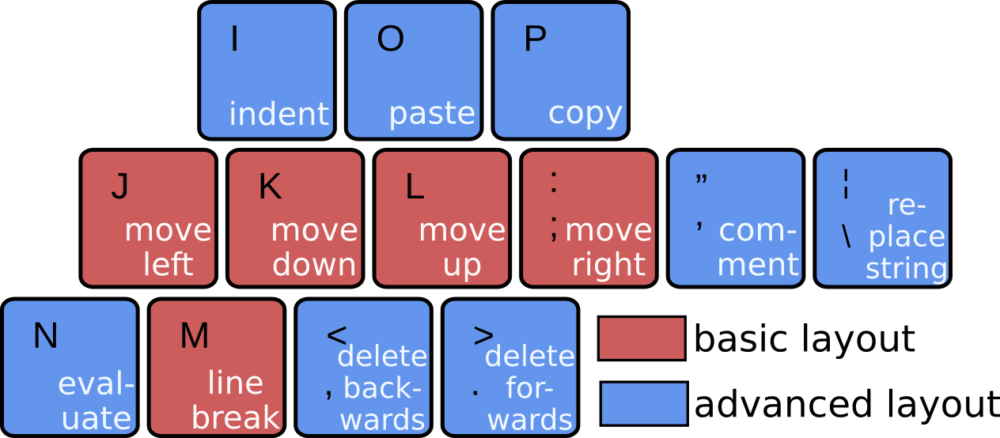
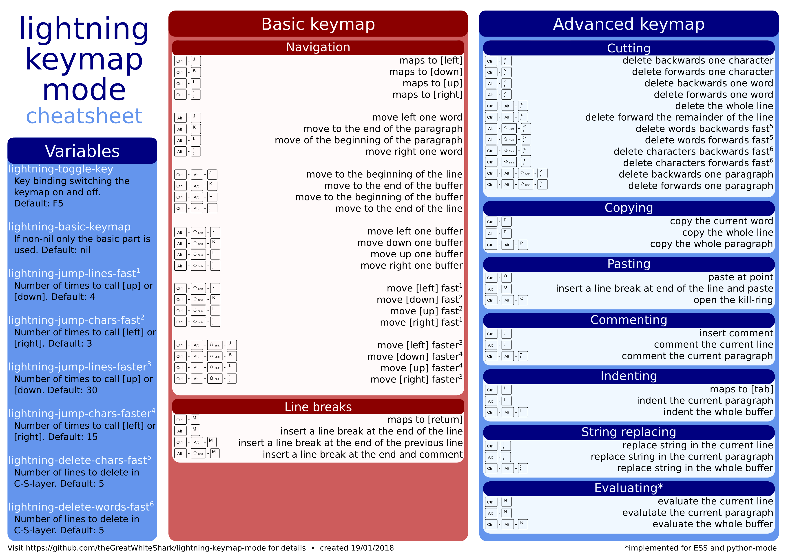

This minor mode intends to provide a faster handling of Emacs
during actual file editing.

# Motivation

Let's face it, the navigation in plain Emacs is not that
sophisticated. Actually, it's almost unusable. The approach of
[Evil-mode](https://www.emacswiki.org/emacs/Evil), on the other hand,
is not a bad idea but I never really liked the way VI is 
doing things. Context switches are just not my style. I definitely
prefer the key combination approach of Emacs.

So what can be done instead? Well, why not creating a mixture of both
worlds? 

# Usage

In the **lightning-keymap-mode** a keymap tailored for fast navigation and
editing is superimposed on top of your regular keymaps using a *minor
mode*. Since this might shadow some essential key bindings you use on
a regular basis, you can turn the mode on and off using **F5**.

There are two basic ideas to this package:
1. Navigation happens using the **j**, **k**, **l**, and **; keys**
   and there are a bunch of useful and frequently used commands placed
   on the surrounding keys (like killing (cutting), yanking (pasting),
   copying, line breaks etc.)
2. There are several different **'layers'** invoked by the **Ctrl**,
   **Meta**, and **Shift** key (and combinations of these).
   While the *Ctrl* key is invoking basic (slow) navigation, like
   moving forward or backward one line or character, the *Meta* key
   speeds things up by moving forward or backward a word or
   paragraph. The combination of both features the most fast
   behaviour (e.g. *Ctrl + Meta + ;* will move the point to the end of
   a line and *Ctrl + Meta + l* to the beginning of the buffer). 
   A notable exception is *Meta + Shift*, which is used to navigate 
   between buffers. 
   
The second idea is also applied on most of the additional key
bindings: *Ctrl + ,* deletes backwards a character, *Meta + ,* deletes
backwards a word, and *Ctrl + Meta + ,* deletes the current line
(apart from this, those commands are also sensitive towards marked
regions). 

The evaluation of code chunks bound to the **n** key are currently just
supported for **ESS** and **python-mode**.

# Installation

Make sure you have an **Emacs 25.1 or newer**
[installed](https://www.gnu.org/software/emacs/download.html#gnu-linux). 

In order to use the lightning-keymap-mode, you have to clone this
repository to your local device

``` bash
git clone git@gitlab.com:theGreatWhiteShark/lightning-keymap-mode.git
```


and add the following lines to your *.emacs* file in your home
folder.

``` cl
(add-to-list 'load-path "~/PATH-YOU-CLONED-LIGHTNING-KEYMAP-MODE-TO")
(require 'lightning-keymap-mode)
(lightning-keymap-mode 1)
```

# Customization

By setting the **lightning-basic-keymap** variable to non-nil, the
user can decide whether she wants to use just the basic navigation and
line breaking instead of the full keybindings offered by the
lightning-keymap-mode. 

If the variable **lightning-keymap-mode-modifies-string-replacement**
is set to non-nil, not the internal `string-replace` function, but a
customized version `lightning-keymap-mode-replace-string` will be
used. Within this function the default option of the *FROM* argument
of the replacement function (what to replace) will be set according to
word at point (at the current position). Therefore, it loses the
ability to perform the last replacement as the default. You are free
to decide on your own which functionality you find more useful.

For additional information and customization please refer to the
[customization](https://www.gnu.org/software/emacs/manual/html_mono/emacs.html#Easy-Customization)
group *Editing > Lightning* or the comment section in the beginning of
[lightning-keymap-mode.el](lightning-keymap-mode.el).

# Notes

If you plan to use **YASnippet** in combination with
**lightning-keymap-mode**, be sure to use a YASnippet version >=
0.12.0! 

---

### License

This package is free software; you can redistribute it and/or modify it
under the terms of the GNU General Public License, version 3, as
published by the Free Software Foundation.

This program is distributed in the hope that it will be useful, but
without any warranty; without even the implied warranty of
merchantability or fitness for a particular purpose.  See the GNU
General Public License for more details.

A copy of the GNU General Public License, version 3, is available at
<http://www.r-project.org/Licenses/GPL-3>
